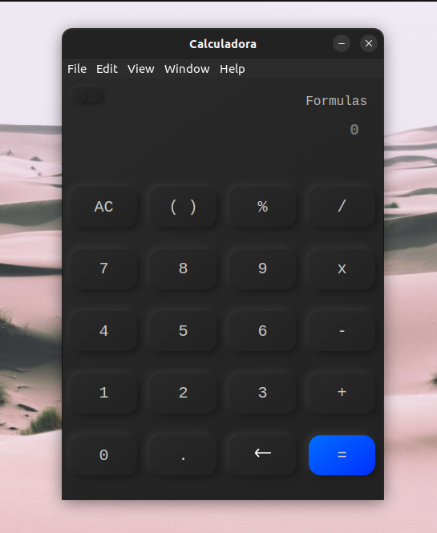
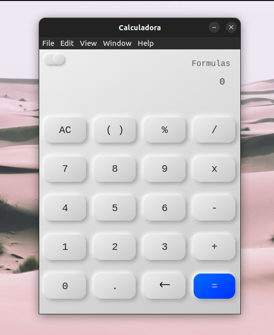

## <h1 align="center">Math-my</h1>

---


Math-my is a basic cross-platform desktop calculator, based on web technologies, with a neomorphism style design, it has two themes, light and dark.

# Installation

---

Cloning the repository whit commad.

```bash
git clone https://github.com/EddyBel/Calculadora.git
```

In the folder the proyect ejecute the command for run development proyect.

```bash
npm install
npm start
```

To compile the scripts for linux, run the command

```bash
npm run build-linux
```

## Project status

---

### Current features

- Addition
- Subtraction
- Division
- Multiplication
- Percentage

### Pending features

- Operations within parentheses
- Adjustments to button states

# Project view

---




## Technologies

---

- HTML
- Javascript
- CSS
- Electron
- NodeJs
